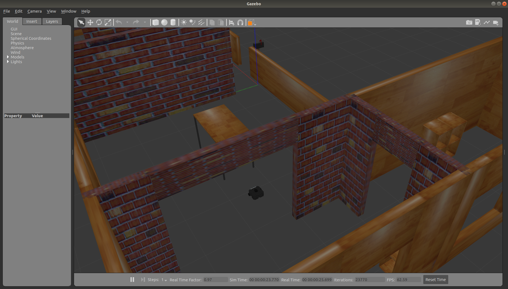

# Problem Statement

The main challenge posed in this task as mentioned earlier is of  **Mapping and Navigation**.

You are expected to navigate your robot model through a sequence of waypoints in the given gazebo world by planning a path that avoids the walls and obstacles in the world.

Initially, the robot must spawn at the point having coordinates [-4.1 , 2.4]. Then it has to traverse to the points in the specific sequence.

**StartPoint**: [-4.1 , 2.4]
**Waypoint 1**: [6.7, 4.5]  
**Waypoint 2**: [1.0, 3.35]  
**Waypoint 3**: [-6.2, 3.1]  
**Waypoint 4**: [1.2, 0.0]  

## Submission Instruction

The submission should be in a video format and be in this format - 

