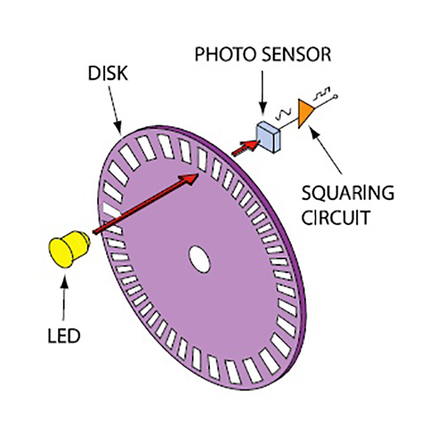
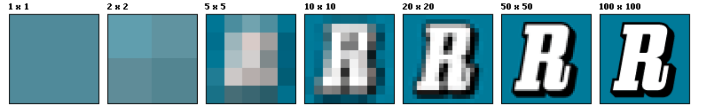
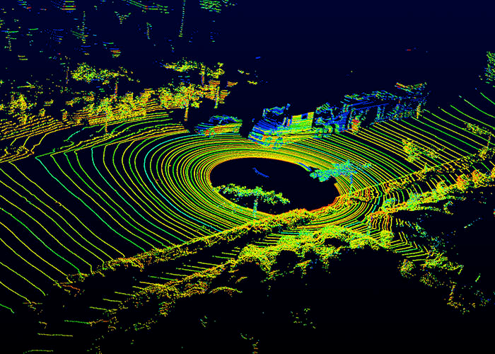

# Task 0 - Fundamentals of Mapping

Even the best perception algorithms are limited by the quality of their sensor data but how does just a sensor provide enough data to generate something as massive as map? Lets get started!

## Sensors

A sensor is any device that measures or detects some change of a property of the environment over time. Sensors are broadly categorised into two types, depending on what property:
1. Sensors which measure values internal to the robot like motor speed, wheel load, robot arm joint angles, battery voltage etc - Proprioceptive. 
2. Sensors acquire information from the robot’s environment like distance measurements, light intensity, sound amplitude etc - Exteroceptive.

### 1. Proprioceptive Sensor
These sensors directly measure the robot states like
1. Position and Velocity (GNSS )
2. Angular rotation rate (IMU, Position Encoder )
3. Acceleration(IMU)
4. Heading(IMU,GPS)

#### 1.1. GNSS (Global Navigation Satellite Systems) / GPS (Global Positioning System)

GNSS receivers are used to measure ego robot's position, velocity, and sometimes heading. Location (only the latitude and longitude) are calculated using one of the localisation
concept, called as Trilateration. 

#### 1.2. IMU

An Inertial Measurement Unit (IMU) is a device that is mounted in a fixed position within the body of your robot. It needs to be in a fixed position of the robot, so that it is aware of where its anchored placement is. 

From this fixed position within the robot, the IMU will keep track of the
movement and position of itself. Usually consisting of several gyroscopes and accelerometers, the IMU provides to the controller of the robot an indication of the pitch, roll, and heading of itself (these are referred to as rotational parameters as sourced by the gyroscopes), and also tracks the linear acceleration of the robot (that’s by the accelerometers).

#### 1.3. Position Encoder

A Position Encoder are also called odometry sensors. This sensor tracks the wheel rates of rotation, and uses these to estimate the speed and heading rate of change of the ego robot. This is the same sensor that tracks the mileage on your vehicle.

The optical encoder has an LED light source, a light detector, a “code” disc/wheel mounted on the shaft, and output signal processor, refer the figure below. The disc has alternating opaque and transparent segments and is placed between the LED and detector so it intermittently interrupts the LED’s beam as it rotates. The detector responds to the series of light pulses it receives and sends that information to the processor, which actually extracts the motion information (amount of rotation).

### 2. Exteroceptive Sensor

Exteroceptive sensors acquire information from the robot’s environment; e.g. distance measurements, light intensity, sound amplitude. Hence exteroceptive sensor measurements are interpreted by the robot in order to extract meaningful environmental features.

#### 2.1. Camera

Cameras are a passive, light-collecting sensor that are great at capturing rich, detailed
information about a scene. Some believe that the camera is the only sensor truly required for any system. But state of the art performance is not yet possible with vision alone.

Comparison metrics:
1. Resolution: The resolution is the number of pixels that create the image.Below you'll see
an image with various resolutions.

2. Field of view (FOV): The field of view is defined by the horizontal and vertical angular extent that is visible to the camera, and can be varied through lens selection and zoom.
3. Dynamic Range: The dynamic range of the camera is the difference between the darkest and the lightest tones in an image.

There is an important trade off in cameras and lens selection, that lies between the choice of FOV and resolution. Wider field of view permit a lager viewing region in the environment. But fewer pixels that absorb light from one particular object. As the field of view increases, we need to increase resolution to still be able to
perceive with the same quality, the various kinds of information we may encounter. Other properties of cameras that affect perception exist as well, such as focal length,
depth of field and frame rate.

#### 2.2. LIDAR

LIDAR sensing involves shooting light beams into the environment and measuring the reflected return. By measuring the amount of returned light and time of flight of the beam. Both in intensity with respect to the range of the reflecting beam, object distance is be estimated. 

LIDAR usually include a spinning element with multiple stacked light sources. And outputs a three dimensional point cloud map, which is great for assessing scene geometry.
Because it is an active sensor with it's own light sources, LIDAR sensors are not effected by the environments lighting. So LIDAR do not face the same challenges as cameras when operating in poor or variable lighting conditions

Comparison metrics:
1. Number of beams: The first is the number of sources it contains with 8, 16, 32, and 64 being common sizes.
2. Points per second: more the value, faster the point collection. Hence, the more detailed the 3D point cloud can be.
3. Rotation rate: The higher this rate, the faster the 3D point clouds are updated.
4. Field of view, which once again, is the angular extent visible to the LIDAR sensor