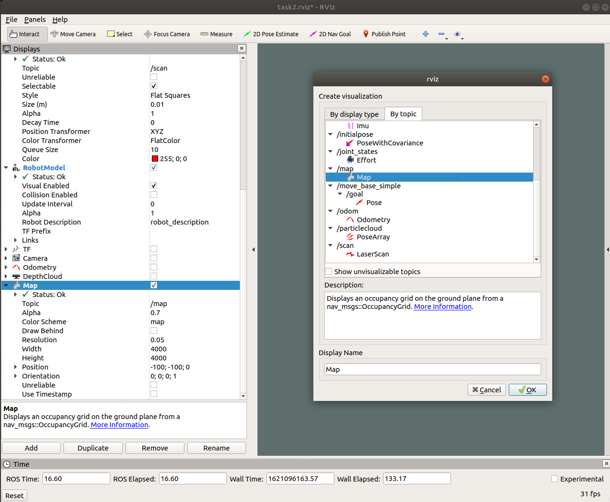
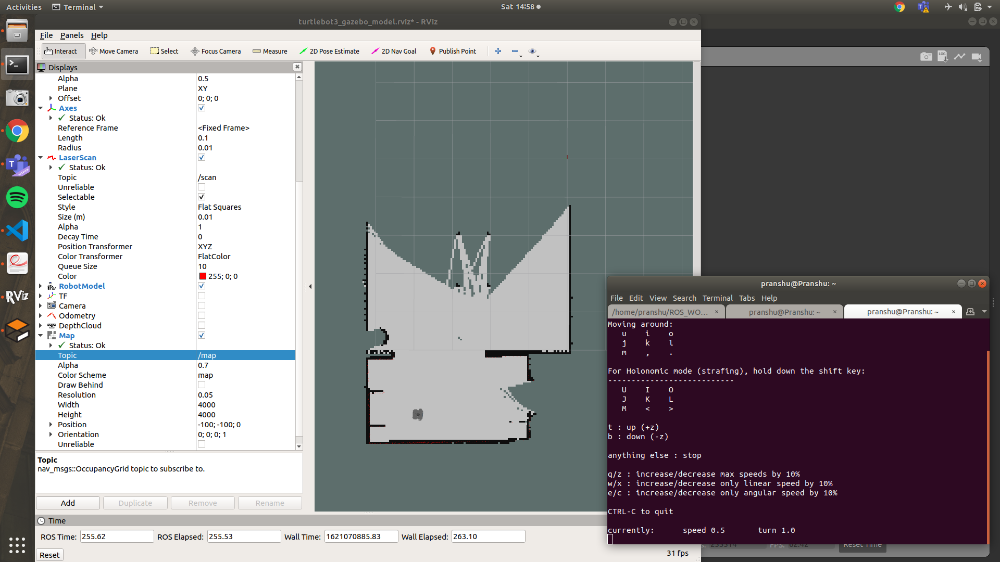
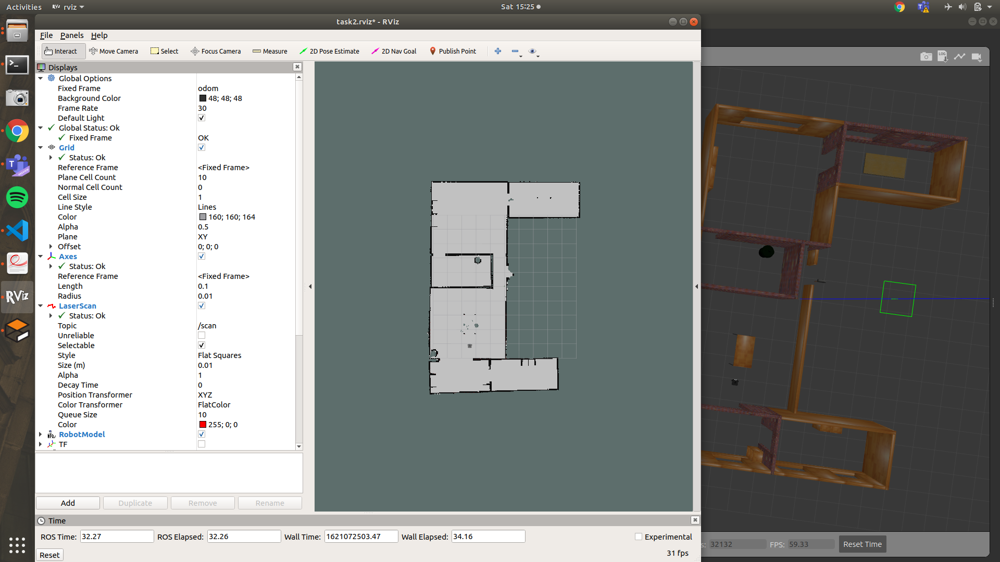

# Task 1 - Mapping
In this task, we'll be first creating a map for the entire task along with uploading it on our parameter server for the bot to navigate around.

## 1. Introduction
A map is a representation of the environment where the robot is operating or is to be operated. It should contain enough information to localise and plan trajectories ahead in advance avoiding any obstacles necessary. 

In order to create a map it is required to merge the measurements and readings from sensors from previous positions and also keep a track of current measurements and the pose of the bot as they are changing to basically get an idea of the surroundings. To accomplish this, we use a technique called Simultaneous Localisation and Mapping(SLAM). It estimates the map of the environment and the trajectory of a moving device using a sequence of sensor measurements.

There are many techniques in SLAM but in our project, we'll be taking a look at Gmapping. The working of the technique is as follows - It first takes the measurement from odometry and laser scan, it tries to localise the bot (position it correctly) along with the laser scan matching and then using Extended Kalman Filter (EKF) it estimates the output by fusing odometry and laser scan matching values. Along with this, it
uses a particle filter for localisation.

More on it can be read here - 
1. Gmapping - https://iopscience.iop.org/article/10.1088/1757-899X/705/1/012037/pdf
2. Kalman Filter - https://www.intechopen.com/books/introduction-and-implementations-of-the-kalman-filter/introduction-to-kalman-filter-and-its-applications
3. Particle Filters - https://web.mit.edu/16.412j/www/html/Advanced%20lectures/Slides/Hsaio_plinval_miller_ParticleFiltersPrint.pdf

A very good source for diving deep into robotics if you are really interested, do check out this NPTEL Playlist - https://www.youtube.com/watch?v=a6_fgnuuYfE&list=PLyqSpQzTE6M_XM9cvjLLO_Azt1FkgPhpH

## 2. Making a Map
As you read above, to perform SLAM, we  first have to build the map of the environment, here we have to pay attention because while placing the bot we have to remember the place where we have deployed the bot in the map(for example the entrance of the room, etc) because the origin of the map is at that point
due to which if origin shifted the localisation will fail.

### 2.1. Installations 
Gmapping package:
```bash
sudo apt-get install ros-melodic-gmapping
```

Teleop keyboard package: (Ignore if already installed)
```bash
sudo apt-get install ros-melodic-teleop-twist-keyboard
```

Navigation package:
```bash
sudo apt-get install ros-melodic-navigation
```

Tf2 package:
```bash
sudo apt-get install ros-melodic-tf2-sensor-msgs
```

AMCL package:
```bash
sudo apt-get install ros-melodic-amcl
```

Map server package:
```bash
sudo apt-get install ros-melodic-map-server
```

Turtlebot3
```bash
sudo apt-get install ros-melodic-turtlebot3
```
### 2.2. Create Package
First thing towards any project is to create a package, go to your directory where all the other diff_drive packages are (diff_drive_description and diff_drive_simulation). Create a new package with the name:
> diff_drive_navigation

Build your package as you had done earlier and inside this package, create a new folder named 
> maps


### 2.2. Gmapping
This package contains a ROS wrapper for OpenSlam's Gmapping. The gmapping package
provides laser-based SLAM (Simultaneous Localization and Mapping), as a ROS node called
slam_gmapping. Using slam_gmapping, you can create a 2-D occupancy grid map (like a building floorplan) from lidar/laser and pose data collected by a mobile robot.

To generate a map of your environment, we first launch our environment in both Gazebo and Rviz: 
```bash
roslaunch diff_drive_simulation envision.launch 
```

Now to initiate mapping, run the following command - 
```bash
rosrun gmapping slam_gmapping scan:=/scan
```



> Note - On your left pane of your Rviz, Click on "Add" and select topic /map in the popup frame.




Once the slam_gmapping node has started, move the robot around the environment using
your keyboard. After you have moved around your robot in the environment check Rviz if the result is
satisfactory. If it is then we save the map using the map_server package. Run the following
command to save the map

```bash
roscd diff_drive_navigation/maps
rosrun map_server map_saver -f envision_map
```

And Wola! You have created your own map!

## 3. AMCL
AMCL or Adaptive Monte Carlo Localisation  is a probabilistic localisation system for a robot moving in 2D, that is, Given a map of the environment (which we had formed earlier) , the algorithm estimates the position and orientation of a robot as it moves and senses the environment. 

The algorithm uses a known map of the environment, range sensor data, and odometry sensor data to localise the robot and using particle filter to estimate its position. The particles represent the distribution of the likely states for the robot. Each particle represents the state of the
robot.

The algorithm is as follows:

1. At start the robot has map of a room and the probability of location and heading are randomly
assigned. Each of this particle is saved in the filter as the possible estimate of the state or position/orientation. 
2. The filter can go through each of the particles and compare it with what the Lidar sensor
output would have returned if that pose was actual one. Some of the wrong guess are removed
3. It will compare the the scene seen from the particle pose to the actual robot pose, the closer
the scenes match higher the probability. Higher probability particles are given more weights.
The particles are re-sampled by removing low probability particles.
4. As the robot moves the estimated motion is applied to every particles predicting each of the
poses whether it is same as current position of robot.
5. Again step 2 is repeated , particles get concentrated with very few distributions and aligns the
actual robot pose.
6. The algorithm recalculates number of particle required for new batch after each generations of
poses, as distributions become narrow. 

Sampling method called KLD (Kullback–Leibler divergence) generates particles based on the difference in odometry reading and estimated pose of particles .(i.e. smaller sample size when when particles get converged) hence called Adaptive Monte Carlo Localisation.

### 3.1. Creating Launch files for AMCL

Go to your new package you had created earlier (diff_drive_navigation) and create a new folder with the name:
> launch

Now create a new launch file -
> amcl.launch

and add the following contents:

```xml

<launch>
<!-- Arguments -->

<arg  name="scan_topic"  default="scan"/>
<arg  name="initial_pose_x"  default="-4.092771"/>
<arg  name="initial_pose_y"  default="2.431664"/>
<arg  name="initial_pose_a"  default="0.0"/>

<!-- AMCL -->
<node  pkg="amcl"  type="amcl"  name="amcl">
<param  name="min_particles"  value="500"/>
<param  name="max_particles"  value="3000"/>
<param  name="kld_err"  value="0.02"/>
<param  name="update_min_d"  value="0.20"/>
<param  name="update_min_a"  value="0.20"/>
<param  name="resample_interval"  value="1"/>
<param  name="transform_tolerance"  value="0.5"/>
<param  name="recovery_alpha_slow"  value="0.00"/>
<param  name="recovery_alpha_fast"  value="0.00"/>
<param  name="initial_pose_x"  value="$(arg initial_pose_x)"/>
<param  name="initial_pose_y"  value="$(arg initial_pose_y)"/>
<param  name="initial_pose_a"  value="$(arg initial_pose_a)"/>
<param  name="gui_publish_rate"  value="50.0"/>
   
<remap  from="scan"  to="$(arg scan_topic)"/>
<param  name="laser_max_range"  value="3.5"/>
<param  name="laser_max_beams"  value="180"/>
<param  name="laser_z_hit"  value="0.5"/>
<param  name="laser_z_short"  value="0.05"/>
<param  name="laser_z_max"  value="0.05"/>
<param  name="laser_z_rand"  value="0.5"/>
<param  name="laser_sigma_hit"  value="0.2"/>
<param  name="laser_lambda_short"  value="0.1"/>
<param  name="laser_likelihood_max_dist"  value="2.0"/>
<param  name="laser_model_type"  value="likelihood_field"/>

  

<param  name="odom_model_type"  value="diff"/>
<param  name="odom_alpha1"  value="0.1"/>
<param  name="odom_alpha2"  value="0.1"/>
<param  name="odom_alpha3"  value="0.1"/>
<param  name="odom_alpha4"  value="0.1"/>
<param  name="odom_frame_id"  value="odom"/>
<param  name="base_frame_id"  value="base_footprint"/>
</node>

</launch>
```
Few important parameters include:
1. **min_particles** - minimum allowed number of particles for calculating correlation (default: 100 min
particles) 
2. **max_particles**- maximum allowed number of particles for calculating correlation (default:
5000 min particles)
3. **Initial_pose_x, initial_pose_y, initial_pose_a** - initial pose of x,y and heading angle

### 3.2. Viewing the Map on Rviz with AMCL

Now create a new launch file named in the launch folder
> nav.launch

and add the following contents:
```xml
<launch>

 <!-- Map File which you had generated earlier -->
<arg  name="map_file"  default="$(find diff_drive_navigation)/maps/envision_map.yaml"/>

<!-- Adding the Map to Map Server-->
<node  name="map_server"  pkg="map_server"  type="map_server"  args="$(arg map_file)"  />

<!-- including launch file for localization using AMCL -->
<include  file="$(find diff_drive_navigation)/launch/amcl.launch"  />

</launch>
```

Now in envision.launch file in diff_drive_simulation, add the following line -
```xml
<include  file="$(find diff_drive_navigation)/launch/nav.launch"  />
```
Finally, run the following in a command -
```bash
roslaunch diff_drive_simulation envision.launch
```
You should be getting this sort of screen:


