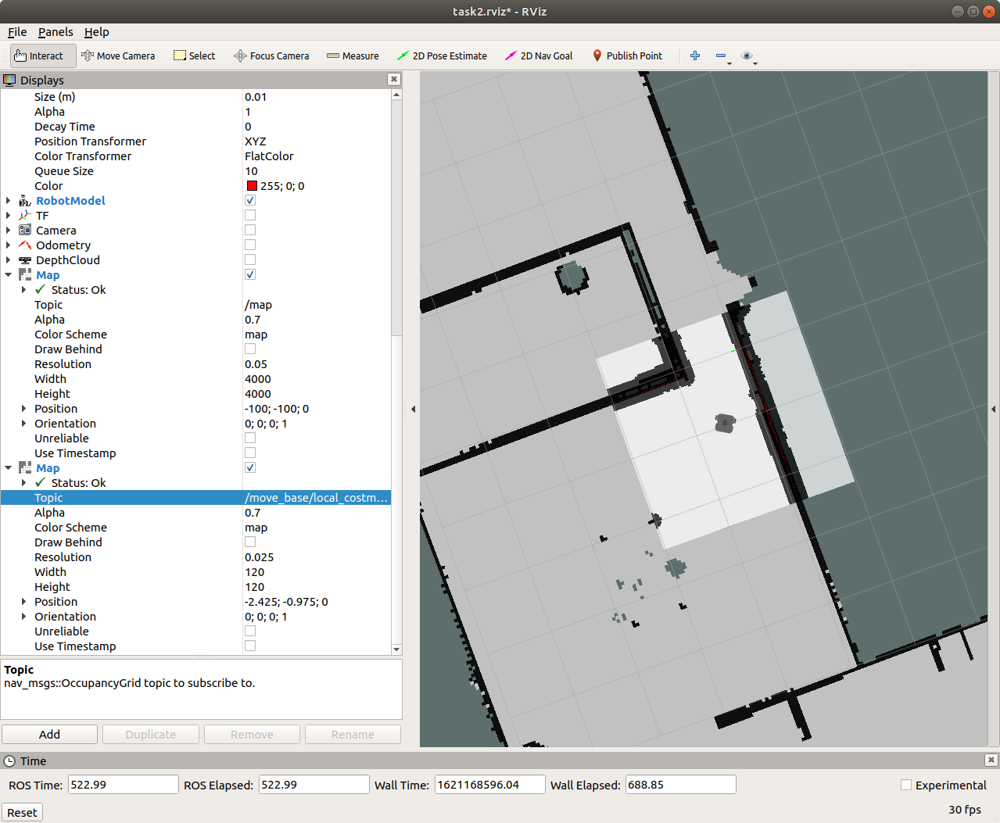
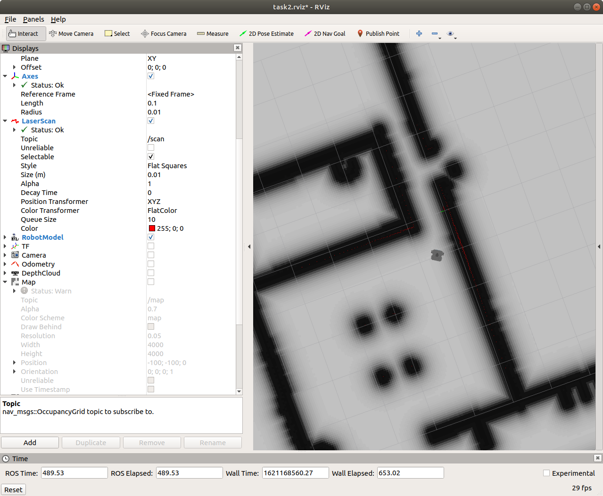

# Task 2.1 - Navigation (CostMaps)

To navigate a robot in an environment, we need the following necessary things: 
1. A map which fully reflects the static environment
2. A localization module
3. A path planning module

Now that we have learnt about the first 2 points, let's dive into Path planning module - The
Navigation stack. The navigation stack consists of 3 components:
1. Costmaps
2. Path Planning algorithm
3. Move base node

## CostMaps

Cost map is a grid in which every cell gets assigned a value (cost) determining distance to
obstacle, where higher value means closer distance. Using this map, the robot plans the path in such a way that it avoids obstacles by creating a trajectory with lowest cost (path planning)

There are 2 costmaps, one for **local planner** which determines obstacles near the robot and the other one for **global planner** to plan a global path from the start point to the goal with keeping the obstacles in mind.

### 1. Common Costmap Parameters
Go to your diff_drive_navigation and create a new folder named config
```bash
roscd diff_drive_navigation
mkdir config
cd config
```
Here onwards, we'll declare parameters which we go into the path planning of our robot. Make a new file named 
> costmap_common_params.yaml

add the following contents to the YAML file -

```json
obstacle_range: 4
raytrace_range: 6
footprint: [[0.12, 0.12], [0.12, -0.12], [-0.12, -0.12], [-0.12, 0.12]]
inflation_radius: 0.5
transform_tolerance: 0.5
use_dijkstra: true
use_grid_path: false  

observation_sources: scan
scan:
  data_type: LaserScan
  topic: scan
  marking: true
  clearing: true

map_type: costmap
```
Common Parameters are used by local and global costmaps. Here are the explanation for the same.

1. **obstacle_range: 4.0**
This parameter defines the maximum range of the laser to detect obstacles.
Here, we have it set at 4.0 meters, which means that the robot will only update its
map with information about obstacles that are within 4.0 meters of the laser.
Maximum obstacle_range is the maximum laser range.

2. **raytrace_range: 6**
This parameter defines range in which area could be considered as free.
Setting it to 6 meters means that the robot will attempt to clear out space in front
of it up to 6 meters. We have to always keep raytrace_range more than obstacle range because if there is an obstacle in between the obstacle_range and raytrace_range then the obstacle will be neglected.

3. **footprint: [[0.12, 0.12], [0.12, -0.12], [-0.12, -0.12], [-0.12, 0.12]]**
This parameter defines the outline of the robot. This is useful during collision
detection. The footprint is either the coordinates of the vertices of your robot(considering
midpoint as (0,0)) or if the robot is circular then the radius of the robot.

5. **inflation_radius: 0.5**
This parameter defines the distance at which the cost of an obstacle should be
considered. If the obstacle is further than this then it's cost is considered to be 0.

6. **observation_sources: scan**
This parameter defines the type of sensor used to provide data.

### 2. Local Costmap

These are the parameters only used local costmaps. 



Make a new file in the same folder with the name:
> local_costmap_params.yaml

and add the following:

```json
local_costmap:
  global_frame: odom
  robot_base_frame: base_footprint
  update_frequency: 5 
  publish_frequency: 2
  static_map: true
  rolling_window: true
  width: 2.5
  height: 2.5
  resolution: 0.025
  transform_tolerance: 0.5
  cost_scaling_factor: 3
  inflation_radius: 0.1
```

1. **update_frequency: 5**
This parameter defines how often cost should be recalculated and at which
frequency the cost map will be updated

2. **publish_frequency: 2**
This parameter defines how often cost maps should be published to topic. This
frequency is nothing but the frequency at which cost map will publish the
visualisation information.

3. **transform_tolerance: 0.5**
This parameter defines latency in published transforms (in seconds), if transforms
are older than this, the planner will stop. This parameter is nothing but the
maximum latency allowed between two transformations. If the tree is not updated at this rate then the robot will be stopped. Its maximum value can be up-to the update frequency because the tf should get updated before the cost map gets updated.

4. **static_map: true**
This parameter defines if map can change in time, true if map will not change.
This parameter is set true if the map is pre mapped and it will not change over time
thus we have to set this parameter as true. If we don’t have a pre initialized map then we have to set this parameter as false.

5. **rolling_window: true**
This parameter defines if the map should follow the position of the robot.
If we set this parameter then the cost map will be always centred around the robot.
As the robot is moving the cost map will be always centered on the robot.

6.   **width: 2.5  height: 2.5  resolution: 0.025**
These parameters define size and resolution of map (in meters). This is nothing but
the height, width and resolution of the map. We can keep the resolution according
to our environment.


### 3. Global CostMap

These are the parameters used by a global cost map. The meaning of the parameters is the
same as for a local cost map, but values may be different. 




Make a file named: 
> global_costmap_params.yaml

and add the following:

```json
global_costmap:
  global_frame: map
  robot_base_frame: base_footprint
  update_frequency: 5 #before: 5.0
  publish_frequency: 5 #before 0.5
  static_map: true
  transform_tolerance: 0.5
  cost_scaling_factor: 6
  inflation_radius: 0.8

```
