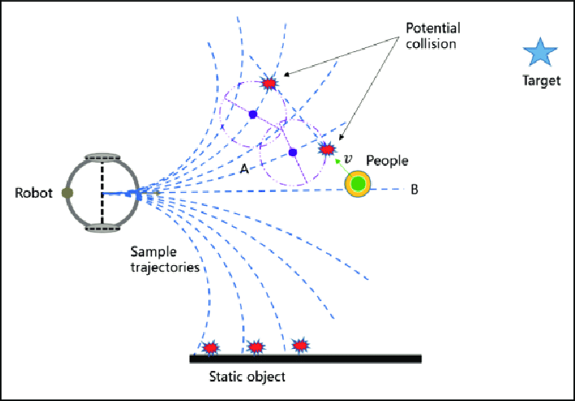

# Task 2.2. Planners

There are 2 types of planners in the Navigation stack:
1. Local Planner - Global planner plans the path from the start to the end goal.
2. Global Planner - Local planner is used to avoid obstacles and get the robot back to the global path after avoiding obstacles.

## Local Planner

The purpose of local planner is to find a suitable local plan at every instance. There are various local planners that are used. Using a map, the planner creates a kinematic trajectory for the robot to get from a start to a goal location. Along the way, the planner creates, at least locally around the robot, a value function, represented as a grid map. This value function encodes the costs of traversing through the grid cells. The controller's job is
to use this value function to determine instantiations change in x, y and theta velocities to send to the robot.

Over this project, we will be using the DWA local planner. The basic idea of the Dynamic Window Approach (DWA) algorithm is as follows:

1. Discretely sample in the robot's control space (dx,dy,dtheta)
2. For each sampled velocity, perform forward simulation from the robot's current state to predict what would happen if the sampled velocity were applied for some (short) period of time.
3. Evaluate the cost of each trajectory resulting from the forward simulation, using a metric that incorporates characteristics such as: distance to obstacles, distance to the goal, distance to the global path, and speed. Discard the trajectories those that collide with obstacles.
4. Pick the minimum cost trajectory and send the associated velocity to the mobile base.
5. Rinse and repeat.



## Global Planner

The purpose of global path planner is to plan the shortest path which avoids all the obstacle from the start point to the goal point. There are a lot of various path planers used such as Djiktstras, D star, potential field but the one we are gonna focus on is A* A star is a grid-based algorithm. It uses the global cost map provided to find the fastest path to the goal point without hitting any obstacle

## Implementing Planner in ROS

To apply the necessary behaviour, we would need to import a few parameters into the parameter server. To do this, in the config folder, create a new yaml file named:

> base_local_planner.yaml

Add the following into the lines in the yaml:

```json
TrajectoryPlannerROS:
  max_vel_x: -.5
  min_vel_x: 0.005
  max_vel_theta: 1.5

  min_vel_theta: -1.0
  min_in_place_vel_theta: 0.4
  acc_lim_theta: 3.2
  acc_lim_x: 2.5
  acc_lim_y: 2.5
  holonomic_robot: false

  escape_vel: -0.1

  path_distance_bias: 2
  goal_distance_bias: 0.1

```
The base_local_planner package provides a controller that drives a mobile base in the plane. This controller serves to connect the path planner to the robot. Using a map, the planner creates a kinematic trajectory for the robot to get from a start to a goal location.

More information on the planners can be found here - http://wiki.ros.org/base_local_planner