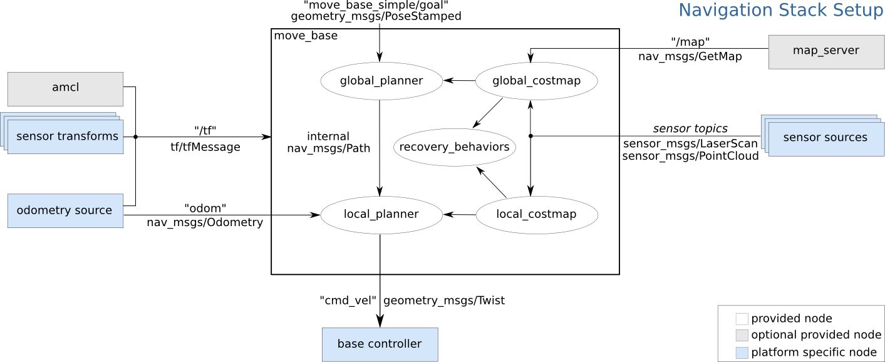
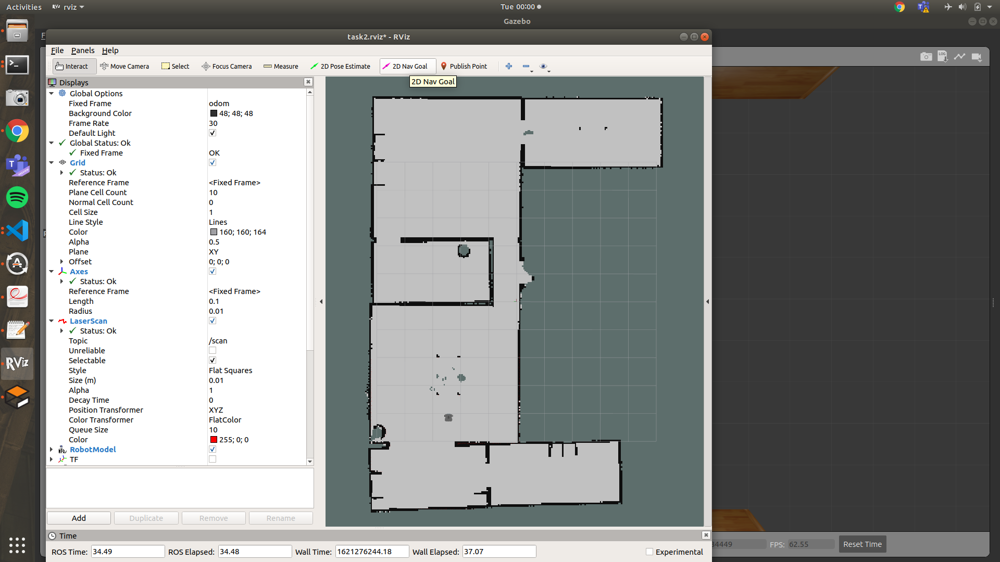
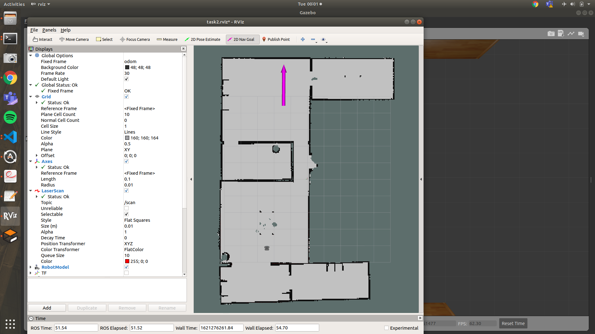
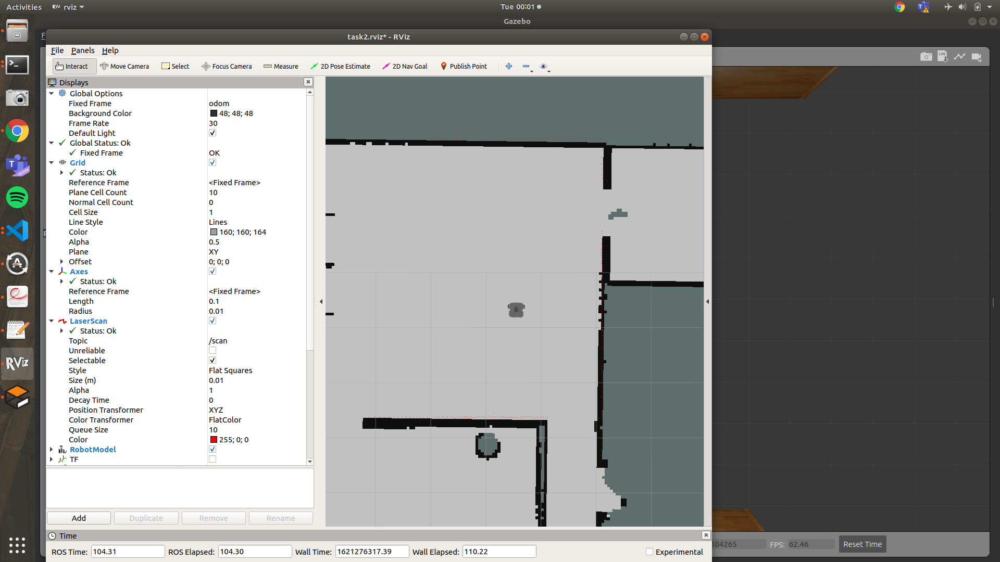

# 2.3. Move Base Client
The move_base node provides a ROS interface for configuring, running, and interacting with the navigation stack on a robot The move_base package provides an implementation of an action that, given a goal in the world, will attempt to reach it with a mobile base. The move_base node links together a global and local planner to accomplish its global
navigation task.




To get navigation running we need to launch move_base node. Let's get into the details of the launch file.

1. One of the components of Navigation is localization. As you have already learnt, we use AMCL for localization so we will have to launch AMCL package in this laucnh file.
2. After calling AMCL, we need to initiate the move_base node and call the config files to set the parameters.

In the launch folder for diff_drive_navigation, make the following launch file:
> nav.launch file

add the following contents:

```xml
<launch>

    <arg name="map_file" default="$(find diff_drive_navigation)/maps/envision_map.yaml"/>
    <node name="map_server" pkg="map_server" type="map_server" args="$(arg map_file)" />

    <!-- including launch file for localization using AMCL -->
    <include file="$(find diff_drive_navigation)/launch/amcl.launch" />

      <!-- Move base -->
  <node pkg="move_base" type="move_base" respawn="false" name="move_base" output="screen">
    <rosparam file="$(find diff_drive_navigation)/config/costmap_common_params.yaml" command="load" ns="global_costmap" />
    <rosparam file="$(find diff_drive_navigation)/config/costmap_common_params.yaml" command="load" ns="local_costmap" />
    <rosparam file="$(find diff_drive_navigation)/config/local_costmap_params.yaml" command="load" />
    <rosparam file="$(find diff_drive_navigation)/config/global_costmap_params.yaml" command="load" />
    <rosparam file="$(find diff_drive_navigation)/config/base_local_planner.yaml" command="load" />
    <param name="planner_frequency" value="8.0"/>
    <param name="controller_frequency" value="8.0"/>
    <param name="planner_patience" value="5.0"/>
    <param name="max_planner_retries" value="38"/>

    <param name="move_base/DWAPlannerROS/yaw_goal_tolerance" value="1.0"/>
    <param name="move_base/DWAPlannerROS/xy_goal_tolerance" value="1.0"/>

  </node>

</launch>
```

A detailed overview on all the parameters can be found here - 
http://wiki.ros.org/move_base

## Sending Goals

To give the goal point click on the "2D Nav Goal" button and click on the point that has to be given as goal and drag your mouse in the direction the robot should be facing towards.



