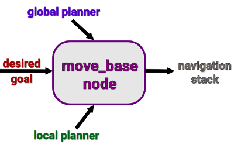

# Task 3 - Sending Commands using Python Script

This Readme aims is to provide you with an example Python code for sending a goal pose (desired position and orientation) to a robot. Usually an autonomous mobile robot is tasked to reach a goal location and in order to do so, it must have some information and combine it, that is, have a map of the environment it is in, perceive its surroundings, localise itself and plan its movements. 

## 1. The  actionlib  Library

The ROS navigation stack is based on ROS Actions: indeed Actions are the best choice for cases when a node wants to send a request to another node and will receive a response after a relatively long time. 

To avoid leaving the user wondering what’s happening and if all is going as desired, Actions implement a  _feedback_  mechanism, which let the user receive information every now and then. Actions are Client-Server-based: the  _actionlib  library_ provides the tools and interface to set up an Action Server to execute the requested goals sent by the Client. 

The main elements of an action mechanisms are:  _goal_,  _result_, and  _feedback_. Each one of them is specified by a ROS Message type, contained in an action definition file, with “_.action_” extension.

## 2. The  MoveBase  node

The _move_base ROS Node_, is a major component of the navigation stack which allows to configure, run and interact with the latter. The move_base node implements a SimpleActionServer, an action server with a single goal policy, taking in goals of  _geometry_msgs/PoseStamped_  message type.

 To communicate with this node, the SimpleActionClient interface is used. The move_base node tries to achieve a desired pose by combining a global and a local motion planners to accomplish a navigation task which includes obstacle avoidance.


 
## 3. The Code

```python
#!/usr/bin/env python
# license removed for brevity

import rospy
from geometry_msgs.msg import Twist
from sensor_msgs.msg import LaserScan
from nav_msgs.msg import Odometry
import math

from tf.transformations import euler_from_quaternion

# Brings in the SimpleActionClient
import actionlib
# Brings in the .action file and messages used by the move base action
from move_base_msgs.msg import MoveBaseAction, MoveBaseGoal

global pose
pose = [0, 0, 0]

def odom_callback(data):
    global pose
    x  = data.pose.pose.orientation.x
    y  = data.pose.pose.orientation.y
    z = data.pose.pose.orientation.z
    w = data.pose.pose.orientation.w
    pose = [data.pose.pose.position.x, data.pose.pose.position.y, euler_from_quaternion([x,y,z,w])[2]]


def movebase_client():

   # Create an action client called "move_base" with action definition file "MoveBaseAction"
    client = actionlib.SimpleActionClient('move_base',MoveBaseAction)
   # Waits until the action server has started up and started listening for goals.
    client.wait_for_server()

   # Creates a new goal with the MoveBaseGoal constructor
    goal = MoveBaseGoal()
   # For storing goal locations
    goal_x = [6.673088]
    goal_y = [4.473371]

    goal.target_pose.header.frame_id = "map"


    #------------Goal 1-----------------
    goal.target_pose.pose.position.x = goal_x[0]
    goal.target_pose.pose.position.y = goal_y[0]
    # No rotation of the mobile base frame w.r.t. map frame
    goal.target_pose.pose.orientation.w = 1


    # Sends the goal to the action server.
    client.send_goal(goal)

# If the python node is executed as main process (sourced directly)
if __name__ == '__main__':
    try:
       # Initializes a rospy node to let the SimpleActionClient publish and subscribe
        rospy.init_node('movebase_client_py')
        rospy.Subscriber('/odom', Odometry, odom_callback)
        movebase_client()
    except rospy.ROSInterruptException:
        rospy.loginfo("Navigation test finished.")
```

### Go through the following to better understand everything - 

1. _actionlib  library_- http://wiki.ros.org/actionlib#Client-Server_Interaction
2. _move_base ROS Node_ - http://wiki.ros.org/move_base
3. _geometry_msgs/PoseStamped_ - http://docs.ros.org/api/geometry_msgs/html/msg/PoseStamped.html


### Reference -
https://hotblackrobotics.github.io/en/blog/2018/01/29/action-client-py/